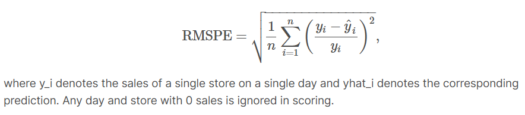
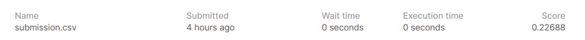
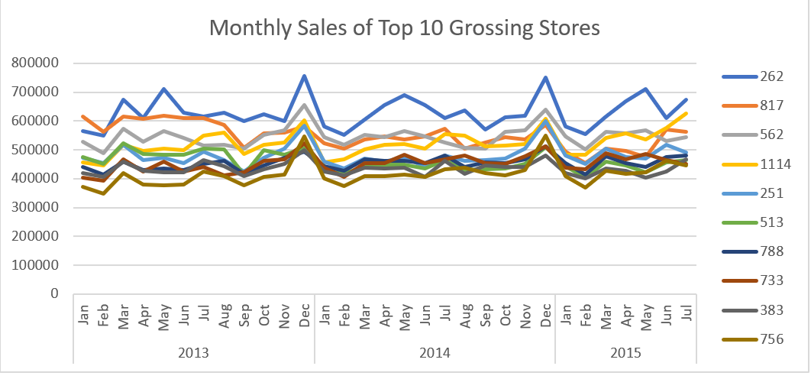

# rossmann_stores

### NOTE:
The charts_and_tables, train and train_mod files were too big to upload to GitHub

## Introduction:

This project is based on the 2015 Rossmann Store Sales Kaggle competition, where participants are asked to create a predictive model that forecasts the daily sales of Rossmann stores. Along with the predictive model, I have also created data visualizations and conducted some statistical tests to provide more insights into the data.

All of the details of the competition and original data files can be found at: https://www.kaggle.com/c/rossmann-store-sales/overview

## Problem Outline:

Rossmann operates over 3,000 drug stores in 7 European countries. Currently, Rossmann store managers are tasked with predicting their daily sales for up to six weeks in advance. Store sales are influenced by many factors, including promotions, competition, school and state holidays, seasonality, and locality. With thousands of individual managers predicting sales based on their unique circumstances, the accuracy of results can be quite varied.

We are provided with 4 csv files for the competition, all of which can be on the Kaggle competition site page. They are titled train, test, store, sample_submission.

The train file contains over 1 million records with information regarding the daily operations of a sample of 1115 out of the over 3000 stores that Rossmann has. It includes information such as the daily sales of the store, the number of customers on that day, the actual date, whether the store was running a promotion on that day or not, whether if it was a school or state holiday on that day etc. This is intended to be our training set for the model.

The store file contains information regarding each of the 1115 stores themselves. This includes things such as the store’s type, the assortment of items that they carry, distance between them and their closest competitor etc.

The test file is our testing set, it contains all the same information as the training set minus the sales and number of customers as the sales is what we’re trying to predict.

The sample_submission is just an example of the format our submission should be in.

## Predictive Modeling:

Along with these 4 files, I have added a train_mod file and test_mod file which is a combined and cleaned version of the original train and test files. They both combine the original store file with the train and test files for a more complete training and testing set. They both also contain new features that were engineered from the other features for ease of use.

The rossmann_models file contains the jupyter notebook that I used to build the models in. I tested out a linear regression and random forest model for this problem and went with the random forest model in the end as it gave the best results. The submissions are evaluated on the Root Mean Square Percentage Error (RMSPE) which is defined as:

 
The submission predicted by the model I created was able to achieve a RMSPE score of 0.227 (the closer to 0, the better the score).
 

## Data Analysis:

Along with the predictive model, I have also created data visualizations with Excel in the file charts_and_tables, completed some statistical tests with python in the file statistical_tests. I have put the summary and conclusions of the findings in the file Rossmann Analysis Report.

Ex.
 

## Future Improvements:

Test more models, use different features, engineering more features, reduce training set size to speed up training as my current gridsearch was taking over 2 hours.
